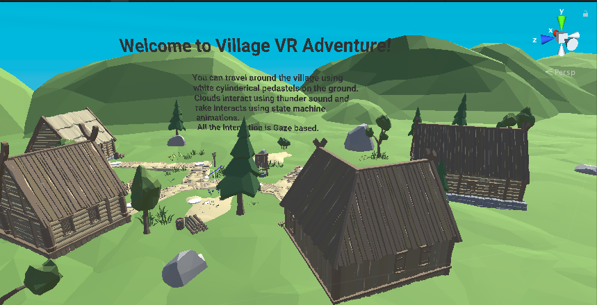
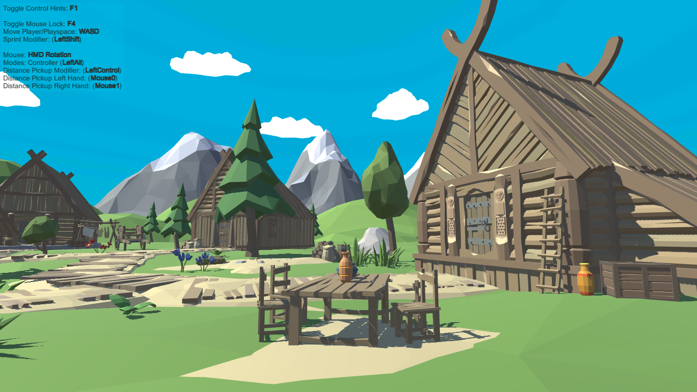

# VillageVR

## Introduction
VillageVR is an Interactive Virtual Reality Environment created using Unity. All the concepts used in this were learned from a Virtual Reality Course offered by the University of London on Coursera.

This project can be viewed by anyone having a simple Head Mounted Display like Google Cardboard.

## Tools Used

### Unity
* I built most of the project in Unity 3D.  Currently, the only way to create fully immersive interactive virtual reality experiences that you can step into and interact with is to use a 3D game engine.

* A 3D game engine is essentially an IDE (Integrated Development Environment) that allows real-time integration of scripts with 3D graphics to produce various kinds of digital media such as Games, Movies, Animations, or in my case a VR Environment.

### Virtual Studio Code
* Virtual Studio Code is an IDE developed by Microsoft that was used for coding various scripts to add interactivity to the VR Environment.

### Blender
* I used Blender to create some of the 3D assets used in the environment. 

## 3D VR Environment
I wanted to create an environment that should sustain the hardware requirements while allowing the users to experience Virtual Reality in an immersive manner. So, I decided to create an open environment consisting of Green Terrains, Mountains, and buildings. I created some of these assets using tools like Unity, Blender, and some were imported from the Unity Asset Store.

## Interaction in VillageVR
In order to create the VR illusions, I had to add interactivity to VR Environment. So, I built multiple interaction scripts each of them serving a different purpose such as Audio, Teleportation, etc. 

Some of these scripts are already provided by Unity as they are often used to add any form of interaction, but I had to modify them according to the specifications of my project. 

Due to hardware restrictions, I decided to only use Sight Based Interaction (Looking at a particular object for a few seconds to interact with it).

Here is a brief description of all the interaction scripts used to add interactivity to the scene.

* **VR Interactive item** is the script that detects the light rays from the main camera which is actually the user’s viewpoint.

* **VR Action Harness** is used to provide the user some feedback that their gaze has been registered and interaction will happen soon.

* **VR Interactive Audio** essentially triggers the audio of the object on and off depending on the output of VR interactive Item Script.

* **VR Interactive Audio** is similar to VR interactive Audio. It triggers an animation whenever gaze is detected from the user.

* **VR Teleport Target** transports the camera base to wherever the user is looking at in the scene. So when a user looks at one pedestal from the main camera the camera base is transferred to that pedestal. Thus, allowing the user to navigate through the VR world.
 
### State Machine Interaction
I also used State Machine-based Interaction which was added to the game object “Rake”. A state machine consists of a number of states, where each state can be an animation. It also consists of transitions between states.

If a user would gaze at the rake, 'RakeStart Animation' would be turned on, and the rake starts working. When the user looks again at the rake, it stops working, and the rake returns to its original position. To implement this interaction, 'VR Interactive Animation' script was added along with 'VR interactive item' and 'VR Action Harness'.

## User Interface in VR

I created a diegetic UI which essentially means that the User Interface will be present inside the VR environment. I added it to guide the users on what to do in the scene and which of the objects can they interact with.

## Results

 

  
 
